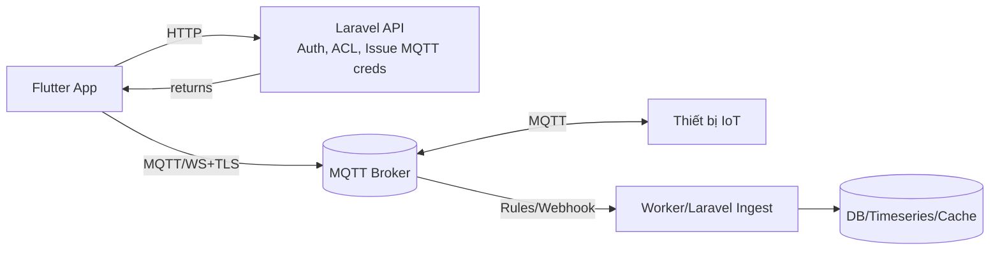
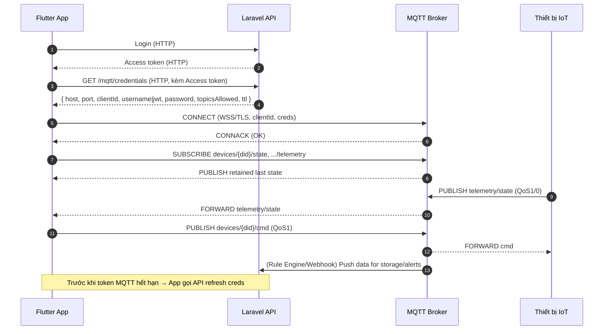

# Tài liệu kỹ thuật: Kiến trúc App Flutter ↔ MQTT Broker ↔ Laravel API

> **Mục tiêu**: Làm rõ *khi nào* app nên kết nối **trực tiếp** đến MQTT broker và *vì sao* vẫn cần **Laravel API**; đưa ra một kiến trúc chuẩn (control plane vs data plane), luồng pairing/provisioning, bảo mật, thiết kế topic & payload, chiến lược lưu trữ, và ví dụ mã.

- **Đối tượng**: Mobile app (Flutter), Backend (Laravel), MQTT Broker (EMQX/HiveMQ/Mosquitto/VerneMQ).
- **Kết luận cốt lõi**: App **kết nối trực tiếp** đến **MQTT broker** cho dữ liệu *realtime* (data plane). **Laravel API** đóng vai trò *control plane*: cấp thông tin kết nối ngắn hạn, ACL theo người dùng/thiết bị, lưu trữ, giám sát, và quy tắc nghiệp vụ.

---

## 1) Tổng quan kiến trúc

**Hai mặt phẳng chính**:
- **Control Plane (HTTP/Laravel)**: Đăng nhập, phân quyền, *cấp* thông tin MQTT (host/port, clientId, chứng thực ngắn hạn), ánh xạ user↔device, quản trị ACL, ghi log, rule cảnh báo, OTA, báo cáo.
- **Data Plane (MQTT)**: Realtime pub/sub giữa **App** ↔ **Broker** ↔ **Thiết bị** (telemetry, trạng thái, lệnh điều khiển).



**Vì sao không “đi qua Laravel” cho realtime?**
- Laravel không phải broker; chuyển tiếp MQTT qua HTTP làm tăng độ trễ, bão hòa tài nguyên, và mất QoS/retain/LWT.
- Trực tiếp **App↔Broker** tận dụng ưu điểm chuẩn MQTT: **QoS**, **retain**, **Will**, **KeepAlive**, **Session**.

---

## 2) Luồng tổng quát end-to-end



**Khi pairing/provisioning** (AP/SmartConfig/BLE):
1. App **trước** khi vào AP/BLE nên **xin sẵn** thông số MQTT từ API (vì vào AP có thể mất Internet).
2. Thiết bị nhận Wi‑Fi + broker endpoint/cred (từ App hoặc từ server tuỳ mô hình).
3. Sau khi thiết bị online, App chuyển sang data plane qua MQTT.

---

## 3) Thiết kế topic & payload (khuyến nghị)

### 3.1. Quy ước topic
Dạng tổng quát (hỗ trợ multi-tenant, phân quyền theo user và device):
```
v1/{tenant}/{uid}/{deviceId}/state           # trạng thái tức thời (online/offline, mode, firmware, ...)
v1/{tenant}/{uid}/{deviceId}/telemetry       # số liệu định kỳ (temp, tds, flow, battery, ...)
v1/{tenant}/{uid}/{deviceId}/event           # sự kiện (alert, fault, button_press, ...)
v1/{tenant}/{uid}/{deviceId}/cmd             # lệnh điều khiển từ app (on/off, set_mode, ...)
v1/{tenant}/{uid}/{deviceId}/rpc/request     # gọi hàm (đồng bộ/không đồng bộ)
v1/{tenant}/{uid}/{deviceId}/rpc/response    # phản hồi RPC
```

**Nguyên tắc**:
- Tất cả topic **lowercase** + dấu gạch ngang thay vì khoảng trắng.
- **Không** lộ dữ liệu nhạy cảm trong **topic** (gắn ở **payload**).
- App chỉ **subscribe** đúng phạm vi `{tenant}/{uid}` của mình (ACL ở broker).
- **Retain** cho `state` để app mới vào nhận được trạng thái gần nhất.
- **QoS**: 
  - Telemetry: QoS 0 hoặc 1 (tùy mức tin cậy yêu cầu).
  - Cmd: QoS 1 (đảm bảo đến).
  - Event quan trọng: QoS 1.

### 3.2. Payload JSON (ví dụ)

**Telemetry**:
```json
{
  "ts": 1725163200000,
  "device_id": "GW-37D-00123",
  "metrics": {
    "tds": 11,
    "flow_lpm": 1.2,
    "temp_c": 26.3,
    "filter_usage_percent": 68
  }
}
```

**State** (retained):
```json
{
  "device_id": "GW-37D-00123",
  "online": true,
  "fw": "1.2.5",
  "mode": "eco",
  "last_seen": "2025-09-01T13:20:00Z"
}
```

**Command**:
```json
{
  "req_id": "2f5a1d",
  "cmd": "set_mode",
  "args": { "mode": "eco" }
}
```

**Event** (alert):
```json
{
  "ts": "2025-09-01T13:25:05Z",
  "severity": "warn",
  "code": "FILTER_NEAR_END",
  "message": "Main filter reaches 85% usage"
}
```

---

## 4) Bảo mật & phân quyền

### 4.1. Kênh truyền
- **WSS (MQTT over WebSocket + TLS)** cổng 443 giúp vượt tường lửa tốt hơn so với TCP 1883/8883.
- **TLS**: Bật bắt buộc; kiểm tra chứng chỉ CA hợp lệ.

### 4.2. Chứng thực & uỷ quyền (2 mô hình phổ biến)
**Mô hình A – HTTP AuthN/AuthZ với Laravel**  
- Broker gọi **HTTP Auth** về Laravel khi client CONNECT/SUBSCRIBE/PUBLISH:
  - `auth`: xác thực `clientId`, `username`, `password|token`.
  - `acl`: kiểm tra quyền pub/sub từng `topic`.
- Ưu điểm: linh hoạt, thu hồi ngay lập tức, dễ ràng buộc theo user/device.
- Nhược: thêm vòng HTTP (nhưng chỉ lúc CONNECT & kiểm ACL; tải nhỏ).

**Mô hình B – JWT token**  
- Laravel **ký** JWT (HS256/RS256) chứa claim `sub` (user), `cid` (clientId), `exp` (hết hạn), và **danh sách topic scope**.
- Broker xác minh JWT và thực thi ACL dựa trên claim.
- Ưu điểm: *stateless*, nhanh.
- Nhược: thu hồi sớm cần cơ chế *denylist* hoặc TTL ngắn.

> **Khuyến nghị**: Dùng **cred ngắn hạn** (TTL 15–60 phút), dùng **clientId duy nhất** theo phiên, buộc **renew** định kỳ. Không embed tài khoản dài hạn trong app.

### 4.3. ACL nguyên tắc
- App của user U **chỉ** được:
  - `subscribe`: `v1/{tenant}/{U}/+/state`, `.../telemetry`, `.../event`
  - `publish`: `v1/{tenant}/{U}/{deviceId}/cmd`, `.../rpc/request`
- Thiết bị **chỉ** được:
  - `publish`: `state`, `telemetry`, `event`, `rpc/response`
  - `subscribe`: `cmd`, `rpc/request`

**Ví dụ ACL (mang tính minh hoạ)** – *Mosquitto style*:
```
user app_u_123
topic read  v1/tenant_a/u_123/+/state
topic read  v1/tenant_a/u_123/+/telemetry
topic read  v1/tenant_a/u_123/+/event
topic write v1/tenant_a/u_123/+/cmd
topic write v1/tenant_a/u_123/+/rpc/request

user dev_GW-37D-00123
topic write v1/tenant_a/u_123/GW-37D-00123/state
topic write v1/tenant_a/u_123/GW-37D-00123/telemetry
topic write v1/tenant_a/u_123/GW-37D-00123/event
topic read  v1/tenant_a/u_123/GW-37D-00123/cmd
topic read  v1/tenant_a/u_123/GW-37D-00123/rpc/request
```

### 4.4. Will Message, KeepAlive, Retry
- **LWT (Last Will & Testament)**: Khi client rớt đột ngột, broker **publish** `state` offline.
- **KeepAlive**: 30–60s; **Clean Session**/Persistent Session tuỳ nhu cầu.
- **Backoff reconnect**: 1s → 2s → 5s → 10s (giới hạn tối đa).

---

## 5) Provisioning/Pairing

### 5.1. AP Mode (thiết bị phát Wi‑Fi riêng)
1. App gọi API lấy sẵn thông tin MQTT (và/hoặc mã ghép đôi 1 lần).
2. App kết nối Wi‑Fi AP của thiết bị → gửi: SSID, password Wi‑Fi, **broker endpoint/cred** (hoặc mã ghép đôi).
3. Thiết bị reboot, vào Wi‑Fi thật → CONNECT MQTT.
4. App trở lại Internet → kết nối MQTT theo cùng broker → thấy `state online`.

### 5.2. SmartConfig hoặc BLE
- Tương tự AP Mode, nhưng truyền thông số qua SmartConfig/BLE.
- Lưu ý **bảo mật**: mã hoá dữ liệu truyền cấu hình; dùng **code hết hạn**.

### 5.3. Anti‑hijack
- **Claiming process**: Thiết bị lần đầu online chỉ **publish** vào `unclaimed/{deviceId}/...`.  
- Server xác thực **ownership** (QR code/serial+PIN), sau đó **gán** `tenant/uid` và **cấp ACL** chính thức.

---

## 6) Tích hợp Laravel (control plane)

### 6.1. API đề xuất

**1) `POST /auth/login`**  
- In: `{ email, password }`  
- Out: `{ access_token, expires_in }`

**2) `GET /me/devices` (Bearer)**  
- Liệt kê thiết bị của user.

**3) `GET /me/mqtt-credentials` (Bearer)**  
- Out:
```json
{
  "host": "mqtt.example.com",
  "port": 443,
  "ssl": true,
  "path": "/mqtt",
  "client_id": "app-u123-1693572000-8f9c",
  "username": "u123",
  "password": "ephemeral_or_jwt_here",
  "topics_allowed": [
    "v1/tenant_a/u_123/+/state",
    "v1/tenant_a/u_123/+/telemetry",
    "v1/tenant_a/u_123/+/event",
    "v1/tenant_a/u_123/+/cmd"
  ],
  "ttl_seconds": 1800
}
```

**4) (Broker→API) `/mqtt/auth`** – *tuỳ mô hình*  
- In: `{ client_id, username, password|jwt }` → Out: `{ ok: true/false }`

**5) (Broker→API) `/mqtt/acl`** – *tuỳ mô hình*  
- In: `{ client_id, action: "publish|subscribe", topic }` → Out: `{ allow: true/false }`

**6) (Broker→API) `/mqtt/ingest`**  
- Broker/Rule Engine **webhook** dữ liệu telemetry/event về đây để lưu DB/kích hoạt cảnh báo.

### 6.2. Gợi ý triển khai Laravel
- **JWT/Passport/Sanctum** cho HTTP auth của App.
- **Redis** lưu token MQTT ngắn hạn và ánh xạ clientId↔uid↔device scope.
- **Policies** kiểm tra quyền truy cập thiết bị khi phát hành creds.
- **Rate limit**: phát hành credentials, refresh.
- **Observability**: log auth/acl, lưu *audit trail* theo user/device.

---

## 7) Lưu trữ & phân tích dữ liệu

### 7.1. Lược đồ tối thiểu
- `devices(id, serial, model, owner_user_id, tenant_id, status, fw, last_seen_at, ...)`
- `device_messages(id, device_id, topic, payload_json, qos, retained, ts)`
- Bảng timeseries chi tiết nếu cần: `telemetry_*` (partition theo thời gian/tenant).

### 7.2. Đường vào dữ liệu
- **Rule Engine (broker)** → **HTTP webhook** đến `/mqtt/ingest` (Laravel).
- Hoặc **MQTT Bridge/Kafka** → worker/ETL.

### 7.3. Chỉ số & cảnh báo
- Ngưỡng TDS, nhiệt độ, lưu lượng, tuổi thọ lõi lọc, rò rỉ nước, v.v.
- Kênh cảnh báo: push (FCM), email, webhook nội bộ, Zalo OA.

---

## 8) Thư viện/SDK (gợi ý sử dụng)

### 8.1. Flutter (Dart)
- Dùng package MQTT client (hỗ trợ **WebSocket + TLS**, QoS, will, keepAlive, auto-reconnect).
- Kiến trúc: repository + state management (Riverpod/Bloc) cho kênh MQTT.

**Ví dụ rút gọn** (kết nối WSS + subscribe/publish):
```dart
import 'dart:convert';
import 'package:mqtt_client/mqtt_client.dart';
import 'package:mqtt_client/mqtt_server_client.dart';

class MqttService {
  final String host;
  final int port;
  final String path;
  final String clientId;
  final String username;
  final String password;
  final String willTopic;
  final Map<String, dynamic> willPayload;

  late final MqttServerClient _client;

  MqttService({
    required this.host,
    required this.port,
    required this.path,
    required this.clientId,
    required this.username,
    required this.password,
    required this.willTopic,
    required this.willPayload,
  }) {
    _client = MqttServerClient.withPort(host, clientId, port);
    _client.secure = true;
    _client.useWebSocket = true;
    _client.websocketProtocols = MqttClientConstants.protocolsSingleDefault;
    _client.websocketPath = path; // ví dụ "/mqtt"
    _client.keepAlivePeriod = 30;
    _client.logging(on: false);
    _client.autoReconnect = true;
    _client.onDisconnected = _onDisconnected;
    _client.onConnected = _onConnected;
  }

  Future<void> connect() async {
    final connMess = MqttConnectMessage()
        .withClientIdentifier(clientId)
        .startClean()
        .withWillTopic(willTopic)
        .withWillQos(MqttQos.atLeastOnce)
        .withWillMessage(jsonEncode(willPayload));
    _client.connectionMessage = connMess;
    try {
      await _client.connect(username, password);
    } catch (e) {
      _client.disconnect();
      rethrow;
    }
  }

  void _onConnected() {
    // TODO: publish app online state if needed
  }

  void _onDisconnected() {
    // TODO: handle reconnection backoff / notify UI
  }

  void subscribe(String topic, {MqttQos qos = MqttQos.atLeastOnce}) {
    _client.subscribe(topic, qos);
  }

  Stream<MqttReceivedMessage<MqttMessage>> get updates => _client.updates!;

  void publishJson(String topic, Map<String, dynamic> data, {MqttQos qos = MqttQos.atLeastOnce, bool retain = false}) {
    final builder = MqttClientPayloadBuilder();
    builder.addString(jsonEncode(data));
    _client.publishMessage(topic, qos, builder.payload!, retain: retain);
  }

  void dispose() {
    _client.disconnect();
  }
}
```

**Gợi ý xử lý state**:
- Lưu danh sách **subscription active** trong state (Riverpod).
- Parse payload JSON → map sang model, notify UI.
- Cơ chế **refresh MQTT creds**: khi gần hết TTL, gọi API để lấy clientId mới + token mới, **reconnect**.

### 8.2. Laravel
- Endpoint `GET /me/mqtt-credentials` sinh:
  - `client_id`: `app-${uid}-${timestamp}-${rand}` (unique per session).
  - `username/password` tạm thời hoặc JWT ký.
  - Ghi Redis: `{client_id → uid, scopes, exp}` để phục vụ HTTP-Auth/ACL.
- Middleware/Policy đảm bảo user chỉ lấy creds cho **device thuộc sở hữu**.

**Ví dụ controller rút gọn** (minh hoạ ý tưởng, chưa phải code hoàn chỉnh):
```php
public function mqttCredentials(Request $req)
{
    $user = $req->user();
    $clientId = sprintf('app-%d-%d-%s', $user->id, time(), bin2hex(random_bytes(3)));
    $ttl = 1800;

    // Ví dụ password ngắn hạn (có thể là JWT tuỳ mô hình)
    $password = bin2hex(random_bytes(16));
    Cache::put("mqtt:$clientId", [
        'uid' => $user->id,
        'scopes' => [
            "v1/tenant_a/u_{$user->id}/+/state:r",
            "v1/tenant_a/u_{$user->id}/+/telemetry:r",
            "v1/tenant_a/u_{$user->id}/+/event:r",
            "v1/tenant_a/u_{$user->id}/+/cmd:w"
        ],
        'exp' => now()->addSeconds($ttl)->timestamp,
    ], $ttl);

    return response()->json([
        'host' => config('mqtt.host'),
        'port' => (int) config('mqtt.wss_port', 443),
        'ssl' => true,
        'path' => config('mqtt.ws_path', '/mqtt'),
        'client_id' => $clientId,
        'username' => (string)$user->id,
        'password' => $password,
        'topics_allowed' => [
            "v1/tenant_a/u_{$user->id}/+/state",
            "v1/tenant_a/u_{$user->id}/+/telemetry",
            "v1/tenant_a/u_{$user->id}/+/event",
            "v1/tenant_a/u_{$user->id}/+/cmd"
        ],
        'ttl_seconds' => $ttl
    ]);
}
```

---

## 9) Vận hành Broker & kết nối hạ tầng

- **Cổng**: Ưu tiên `WSS :443` (reverse proxy Nginx/Traefik) → broker (WS 8083).
- **Sẵn sàng**: cluster broker (HA), sticky session nếu cần, hoặc session persistence.
- **Quan sát**: metrics (connections, msg rate, dropped msgs, backpressure), log auth/acl, cảnh báo.
- **Giới hạn**: set quota topic length, payload size, rate limit per client.
- **Retain policy**: chỉ retain `state` & vài key cốt lõi; dọn dẹp định kỳ.

---

## 10) Mẫu checklist bàn giao

- [ ] App gọi `/me/mqtt-credentials` trước khi vào chế độ pairing không có Internet.
- [ ] MQTT dùng **WSS + TLS**, kiểm chứng CA.
- [ ] **ClientId duy nhất** mỗi phiên; TTL short‑lived.
- [ ] ACL đúng phạm vi `{tenant}/{uid}`.
- [ ] LWT phát `state: offline` khi rớt.
- [ ] QoS: `cmd` = 1, `telemetry` = 0/1, `event quan trọng` = 1.
- [ ] Retain chỉ `state` (và cực ít key khác).
- [ ] Rule Engine/Webhook → lưu DB + cảnh báo.
- [ ] Reconnect backoff & refresh creds trước khi hết hạn.
- [ ] Log/audit đầy đủ cho auth/acl.

---

## 11) Câu hỏi thường gặp (FAQ)

**Q: Có cần Laravel ở giữa đường dữ liệu realtime không?**  
A: Không. Laravel là **control plane**; realtime đi **trực tiếp** App↔Broker để tận dụng MQTT.

**Q: Có thể dùng MQTT TCP 8883 thay vì WSS 443?**  
A: Được. Tuy nhiên WSS 443 vượt tường lửa tốt hơn trên nhiều mạng.

**Q: Vì sao nên cấp cred ngắn hạn?**  
A: Giảm rủi ro rò rỉ khoá dài hạn, cho phép thu hồi nhanh qua TTL/rotate.

**Q: Lưu trữ telemetry ở đâu?**  
A: Broker Rule Engine → HTTP webhook/stream về Laravel → DB (có thể kết hợp TSDB/Kafka nếu lưu lượng lớn).

**Q: Thiết bị chưa claim thì sao?**  
A: Dồn vào namespace `unclaimed/{deviceId}`; chỉ sau khi xác thực chủ sở hữu mới cấp ACL phạm vi người dùng.

---

## 12) Phụ lục: Mẫu cấu hình ACL minh hoạ

**12.1. Mosquitto (acl_file)**
```
# App user u_123
user u_123
topic read  v1/tenant_a/u_123/+/state
topic read  v1/tenant_a/u_123/+/telemetry
topic read  v1/tenant_a/u_123/+/event
topic write v1/tenant_a/u_123/+/cmd
topic write v1/tenant_a/u_123/+/rpc/request

# Device GW-37D-00123
user dev_GW-37D-00123
topic write v1/tenant_a/u_123/GW-37D-00123/state
topic write v1/tenant_a/u_123/GW-37D-00123/telemetry
topic write v1/tenant_a/u_123/GW-37D-00123/event
topic read  v1/tenant_a/u_123/GW-37D-00123/cmd
topic read  v1/tenant_a/u_123/GW-37D-00123/rpc/request
```

**12.2. JWT Claims (tham khảo)**  
```json
{
  "iss": "api.example.com",
  "sub": "user:123",
  "cid": "app-123-1693572000-8f9c",
  "exp": 1693573800,
  "acl": [
    {"pattern": "v1/tenant_a/u_123/+/state", "action": "subscribe"},
    {"pattern": "v1/tenant_a/u_123/+/telemetry", "action": "subscribe"},
    {"pattern": "v1/tenant_a/u_123/+/event", "action": "subscribe"},
    {"pattern": "v1/tenant_a/u_123/+/cmd", "action": "publish"}
  ]
}
```

---

### Kết luận
- **Data plane**: App kết nối **trực tiếp** tới MQTT Broker để đảm bảo **realtime** mượt, tiết kiệm tài nguyên, tận dụng QoS/retain/LWT.
- **Control plane**: Laravel API **cấp quyền và thông tin kết nối**, quản trị vòng đời thiết bị/người dùng, lưu trữ & phân tích dữ liệu, cảnh báo & báo cáo.
- **Bảo mật**: TLS bắt buộc, **cred ngắn hạn**, ACL tinh gọn theo `{tenant}/{uid}/{deviceId}`.

> Khi cần, ta có thể mở rộng: multi-tenant, HA broker, TSDB/Kafka, OTA quản lý phiên bản, rule engine phức tạp, và dashboard giám sát.

